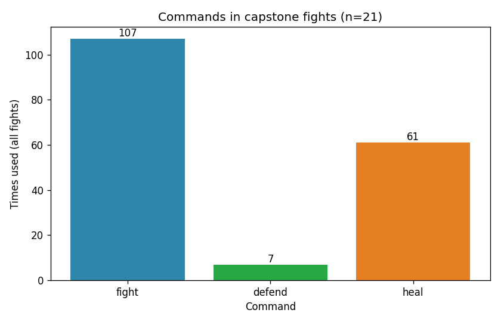

# Game Analyst Report

## 1. Questions

From Day 13 `ANALYST_SPEC.md` (*war with dragon*):

1. Does using **defend** more often raise the win rate?
2. Do winning fights use more **fight** actions than losing fights?
3. Are fights with more **defend**s shorter (fewer rounds) or longer?

## 2. Method

- Fights logged: **21** (`fights.csv` from the Day 15 capstone runs)
- Columns: `fight_id`, `winner`, `rounds`, `fights`, `defends`, `heals`, `player_hp_end`, `boss_hp_end`
- Tools: `summarize.py` for averages / win rate; `make_chart.py` for command totals chart
- Grouping for Q1: fights with `defends > 0` vs `defends == 0`

## 3. Findings

Across 21 fights: player wins **10**, boss wins **11** (player win rate **48%**). Command totals: **fight 107**, **defend 7**, **heal 61**.

1. **Defend and win rate:** Fights that used at least one defend (n=4) all won (**4/4 = 100%**). Fights with zero defends (n=17) won only **6/17 ≈ 35%**. Defend looks helpful, but the defend sample is tiny (only 7 defend actions total).
2. **Fight actions in wins vs losses:** Winning fights average **6.1** `fight` actions; losing fights average **4.2**. Yes — wins use more `fight` actions on average (they also last longer).
3. **Defend and fight length:** Fights with any defend average **13.3 rounds**; fights with none average **7.2 rounds**. More defends go with **longer** fights, not shorter ones.

## 4. Recommendation

**Buff `defend` slightly** so players actually use it: in `do_defend`, change damage taken from `raw // 2` to `raw // 3` (block about two-thirds instead of half).

**Why:** Defend is almost unused (7 uses vs 107 fights / 61 heals). Pure fight-heavy runs often die in ~4 rounds. A slightly stronger defend gives a safer mid-fight option without replacing heal, which already drives most wins (avg **5.7** heals on wins vs **0.4** on losses).

## 5. Limitations

- **Small sample:** 21 fights; only 4 used defend — the 100% win rate for “any defend” can be noise.
- **Strategy not controlled:** Players choose commands freely, so defend may correlate with careful play / more heals rather than *cause* wins.
- **Rare defend use:** With only 7 defends logged, we cannot split “few vs many” defends reliably.
- **What 100 more fights would help:** Re-test win rate by defend count (0 / 1–2 / 3+) with a fixed strategy script, so the defend question stops depending on a handful of lucky runs.
